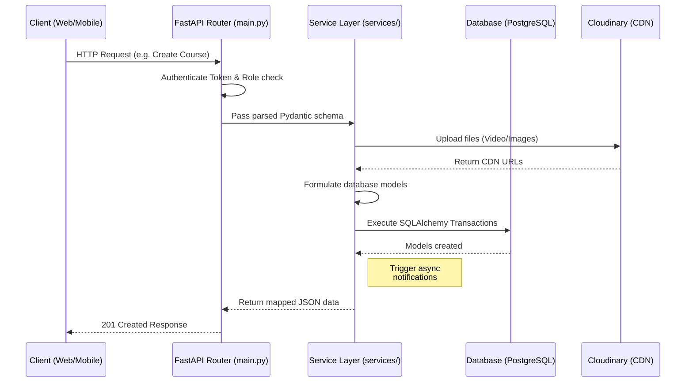
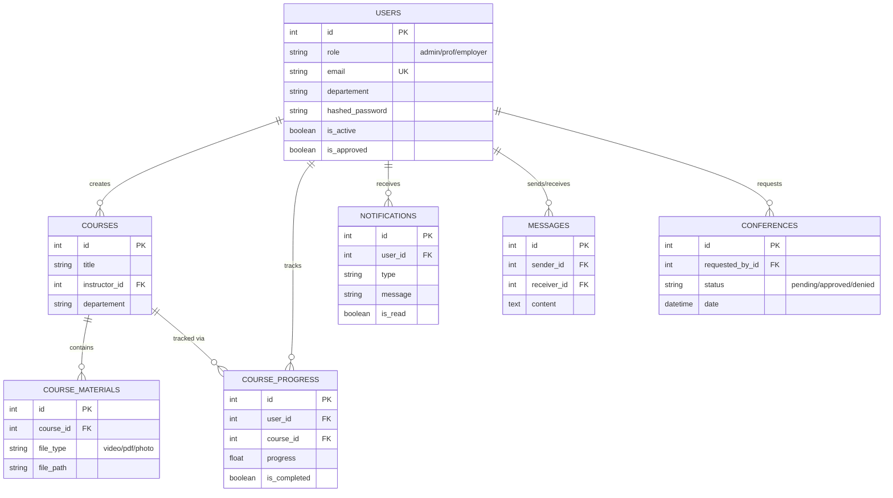

# TAKWINI - Backend System Architecture & API Documentation

> [!NOTE]
> TAKWINI Backend is a comprehensive RESTful API developed for Gulf Insurance Group (GIG) Algeria. It manages an online learning platform, user access, messaging, and department-based training workflows.

## Table of Contents
1. [Introduction](#introduction)
2. [Quick Setup & Deployment](#quick-setup--deployment)
3. [Technologies & Tools Used](#technologies--tools-used)
4. [System Architecture & Design](#system-architecture--design)
5. [Database ER Schema](#database-er-schema)
6. [Scaling & Future Improvements](#scaling--future-improvements)
7. [API Domains & Endpoints](#api-domains--endpoints)

---

## Introduction

TAKWINI represents the backend logic for an enterprise learning platform with built-in corporate features:
- **Role-Based Workflows**: Handled for three primary roles — `admin`, `prof` (Professor), and `employer` (Student/Employee).
- **Communication Flow**: Integrated messaging and internal notification systems.
- **Conferencing**: Built-in scheduling and approval flows for company conferences.
- **Resource Management**: Course materials (PDFs, Videos, Attachments) managed locally and via Cloudinary.

---

## Quick Setup & Deployment

> [!WARNING]
> Ensure you have active credentials for PostgreSQL and Cloudinary before proceeding. The `.env` template is crucial for local testing.

### Prerequisites
- Python 3.9+
- PostgreSQL database
- Cloudinary account 

### Installation Steps

1. **Clone and Setup Virtual Environment**
   ```bash
   git clone <repository-url>
   cd Backend-main
   python -m venv venv
   source venv/bin/activate  # Linux/macOS
   # venv\Scripts\activate   # Windows
   ```

2. **Install Dependencies**
   ```bash
   pip install -r requirements.txt
   ```

3. **Configure Environment**
   Create a `.env` file in the root directory:
   ```env
   POSTGRES_USER=postgres
   POSTGRES_PASSWORD=your_password
   POSTGRES_HOST=your_host
   POSTGRES_PORT=5432
   POSTGRES_DB=railway

   SECRET_KEY=your_secret_key_here
   
   CLOUDINARY_CLOUD_NAME=your_cloud_name
   CLOUDINARY_API_KEY=your_api_key
   CLOUDINARY_API_SECRET=your_api_secret
   ```

4. **Initialize DB & Run**
   ```bash
   python init_db.py
   uvicorn main:app --reload
   ```

Once running, automatic interactive API docs are available at:
- Swagger UI (Test via browser): `http://localhost:8000/docs`
- ReDoc (Static Reference): `http://localhost:8000/redoc`

---

## Technologies & Tools Used

| Tool/Library | Purpose | Rationale |
|---|---|---|
| **FastAPI** | Core Web Framework | High-performance async routing, Pydantic integration, automatic OpenAPI generation. |
| **Uvicorn** | ASGI Server | Lightning-fast async server serving FastAPI natively. |
| **SQLAlchemy** | ORM Framework | Maps Python classes (`models/`) to PostgreSQL tables securely via connection pools. |
| **PostgreSQL** | Primary Database | Secure and scalable transactional relational database handling user states and progress. |
| **Pydantic** | Schema Validation | Assures strictly typed data coming from/going to HTTP requests (`schemas/`). |
| **Jose / Passlib** | Auth & Security | Handling JWT (JSON Web Tokens) lifecycle and bcrypt password hashing. |
| **Cloudinary** | Media Operations | Remote CDN handling heavy course videos and thumbnails to relieve local disk throughput. |

---

## System Architecture & Design

The application follows a **Service-Oriented Architectural Pattern**. Business logic is purposefully decoupled from HTTP routing.

### Architecture Flow Diagram



### Design Concepts
1. **Routers (`main.py`)**: Strictly handle HTTP logic, auth unpacking, schema validation, and returning JSON.
2. **Services (`services/`)**: Heavy lifting logic (e.g., `notification_service.py`, `message_service.py`).
3. **Schemas (`schemas.py`)**: Defines input payloads and output projections to ensure DB fields like password hashes aren't leaked.
4. **Models (`models/`)**: Solely focused on table structures and SQLAlchemy relationships.

---

## Database ER Schema

Below is the Entity-Relationship mapping for the core domain.



---

## Scaling & Future Improvements

> [!TIP]
> To successfully scale this application from hundreds of users to tens of thousands, consider executing these architectural upgrades.

### 1. Architectural Restructuring (Immediate)
**Issue**: `main.py` is currently a monolithic file housing all API routes.
**Action**: Split `main.py` using `APIRouter`. Create a `routers/` directory containing `users.py`, `courses.py`, `admin.py`, etc., and include them in `main.py` via `app.include_router()`.

### 2. Asynchronous Task Queues for Heavy Operations
**Issue**: Sending emails, uploading to Cloudinary, and bulk creating notifications currently block the HTTP thread, creating sluggish frontend responses.
**Action**: Implement **Celery** with a **Redis** or RabbitMQ broker. Offload tasks like `services.notification_service.create_notification` to a Celery worker.

### 3. Caching Strategies
**Issue**: Dashboard loading and retrieving lists of courses strains the databse if queried repeatedly.
**Action**: Inject **Redis** caching at the router level. Use FastAPI's dependency injection to cache `GET` endpoints that rarely change. Intercept creating/updating operations to invalidate the respective caches.

### 4. Database Pagination and Indexing
**Issue**: As data grows, naive `.all()` queries will cause severe latency.
**Action**:
- Add explicit integer pagination to all collection endpoints.
- Ensure composite indices are created on `(user_id, is_read)` for Notifications to massively speed up "Unread Notification" counters.

---

## API Domains & Endpoints

> [!NOTE]
> For exact JSON payload structures, please visit the interactive `/docs` route on your running local server. The list below represents the flow and purpose of domains.

### 1. Authentication & Users
The platform mandates Admin approval for all new registrations. 
- `POST /register`: Formulates a new user (default `is_approved: false`).
- `POST /token`: Fetches a short-lived Bearer JWT. Will reject unapproved users.
- `GET /users/me`: Gets the profile and statistics.
- `POST /admin/approve-user/{user_id}`: Admin gatekeeper for platform access.

### 2. Course Workflows
Professors create courses scoped by "Department". Employees can only enroll in courses belonging to their department.
- `POST /courses/`: Uploads metadata alongside heavy media files to Cloudinary/Disk.
- `POST /courses/{course_id}/enroll`: Creates an active student track.
- `PUT /courses/{course_id}/progress`: Idempotent updates. Marks completion automatically when reaching 100%.

### 3. Communications (Messages & Notifications)
- `POST /messages/`: Real-time internal mail. Supports file attachments.
- `GET /notifications/`: Polled by clients to fetch unread system alerts natively generated by Course creations or Approvals.

### 4. Conferencing
- `POST /request`: Professors ask for meeting slots.
- `PUT /admin/approve/{conf_id}`: Admins vet the schedule. Approved conferences land in `GET /calendar`.

---
*Proprietary - Gulf Insurance Group (GIG) Algeria*
